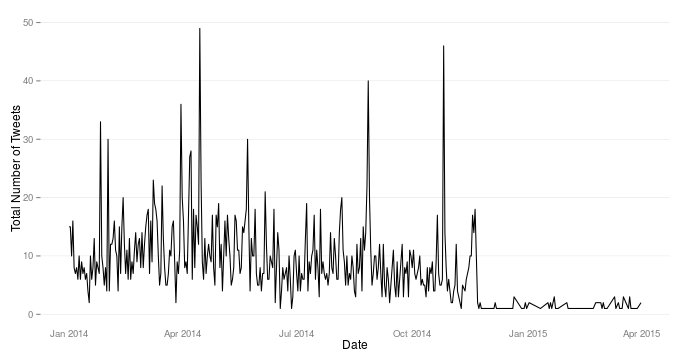
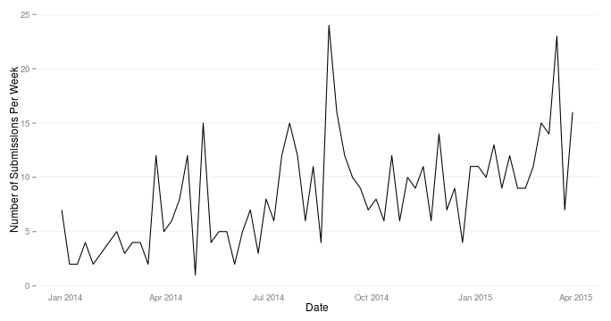

[Foodborne Chicago](https://www.foodbornechicago.org/) is an application that provides an easy online interface to report incidents of food poisoning to the [Chicago Department of Public Health](http://www.cityofchicago.org/city/en/depts/cdph.html) through the city's [open311](http://www.open311.org/) interface. This allows residents to fill out a simple online form to report an incident instead of calling 311 directly. Regardless of the mode of reporting, the reports end up at the Health Department, where they are reviewed. If a given case meets the Health Department's criteria, a CDPH inspector is sent to the restaurant to do an inspection. In many cases, nothing is found, but in some cases, serious violations are found and fixed.

The second part of the application uses the [Twitter API](https://dev.twitter.com/overview/documentation) to proactively find folks complaining of food poisoning in Chicago and send them a link to the form to fill out a report. The Twitter API takes a bounding box (the Chicago area) and a search term (food poisoning) and returns those tweets. Since the end of November 2014, the number of tweets that the API returns have gone down drastically. Here's a graph of the number of daily tweets since 2014...

Foodborne Chicago was not the only application to be affected by this issue. There was an issue logged on the [twittercommunity.com](https://twittercommunity.com/t/search-api-returning-very-sparse-geocode-results/27998/11) message board. An engineer from Twitter replied that there are two issues affecting the number of tweets returned. One is low coverage of tweets with explicit geocodes attached and the second issue is the lack of fallback to the user profile for location approximation. At first the engineers gave an estimate of days to get the issue resolved. The final update has a start date for work on the fix no earlier than April 1, 2015. Hopefully, a team has been assembled and is working on it now. 

The Foodborne Chicago application continues to see an increase in the number of submission via the web form, but this Twitter issue has affected our ability to be proactive and respond to those directly affected with food poisoning. This is a graph of the number of submissions per week through the Foodborne web form since January 2014.  

This Twitter API issue hasn't prevented us from being effective in Chicago, but it's unclear how many more submissions and cases of food poisoning would have been caught with a proactive approach that is enabled using the Twitter API. Twitter has been a great tool for us, and we hope they can fix this issue soon.

